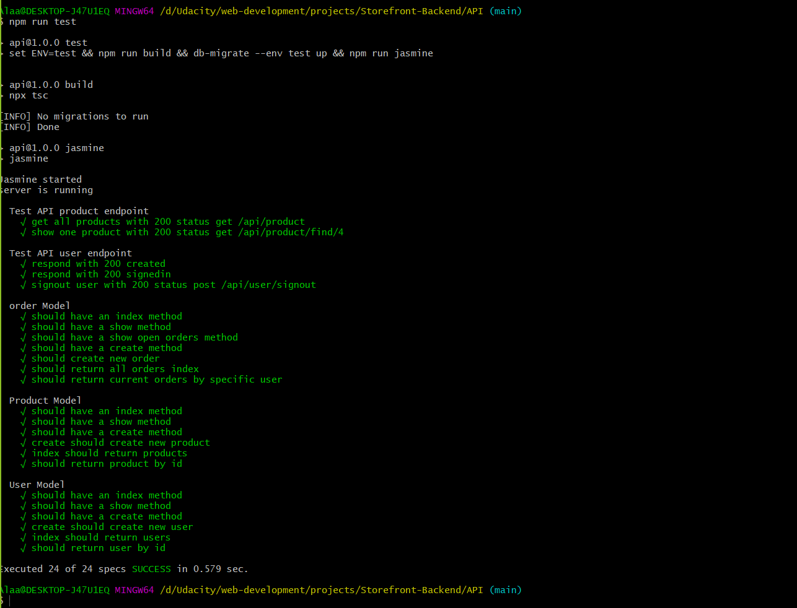
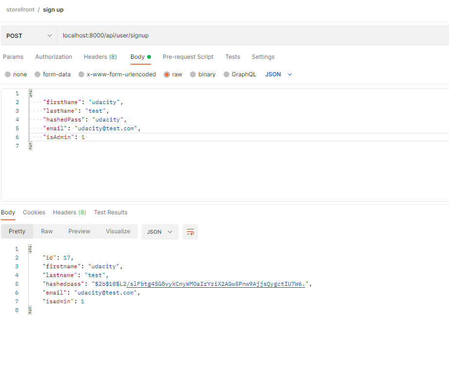
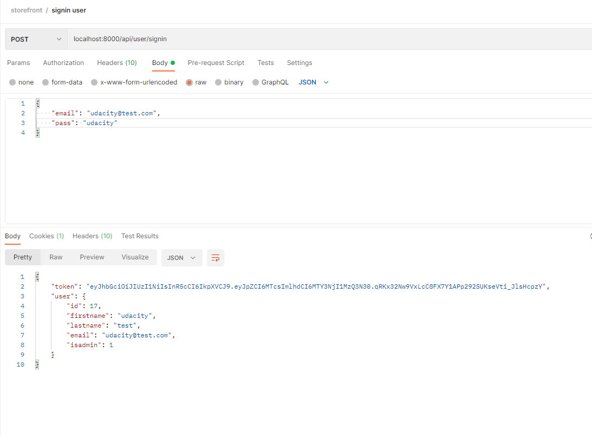
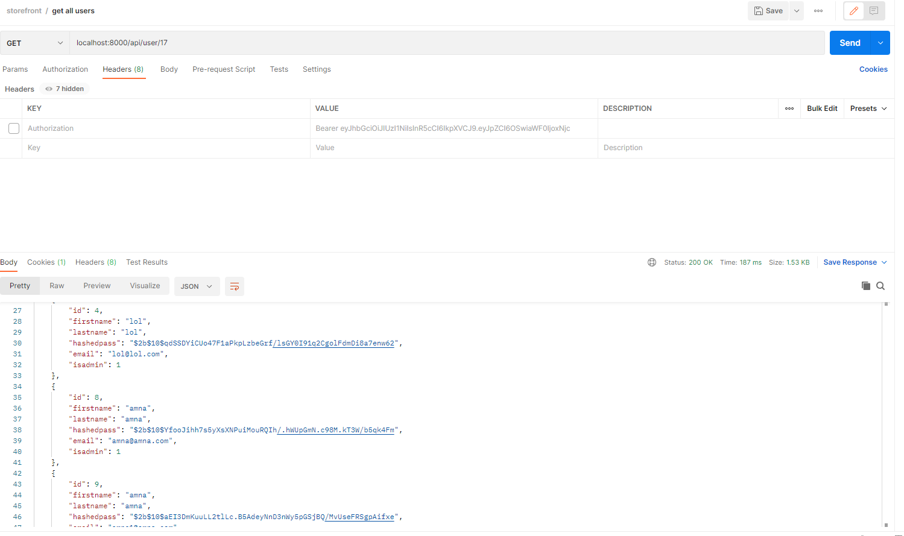
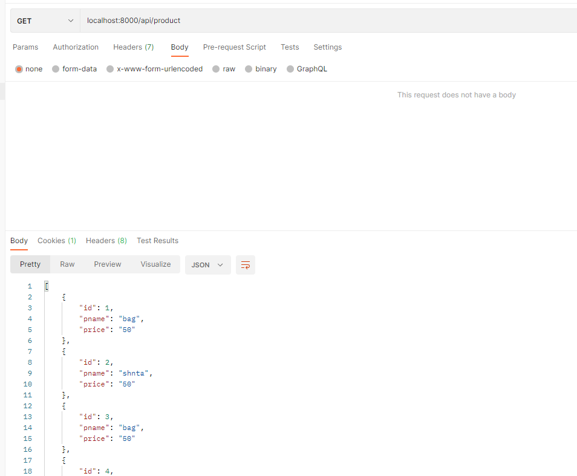
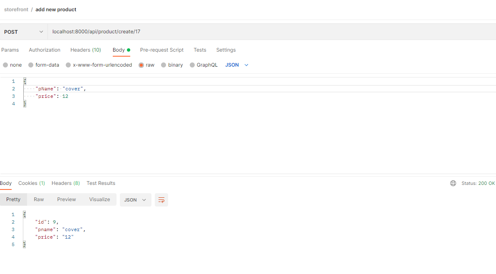
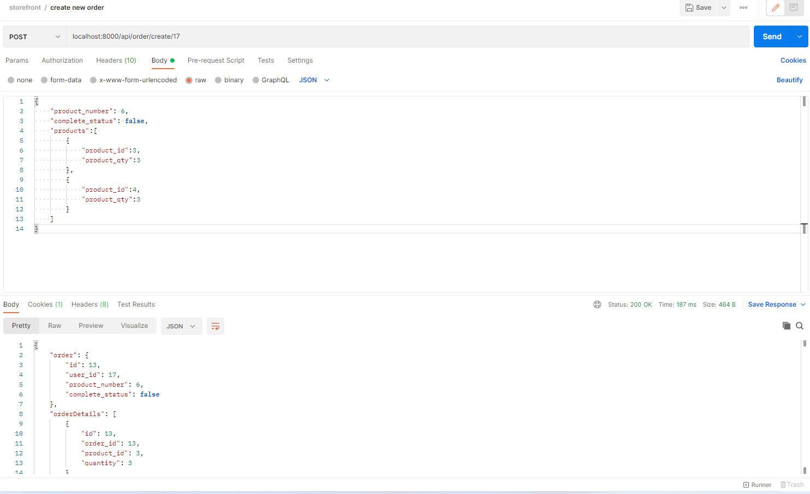
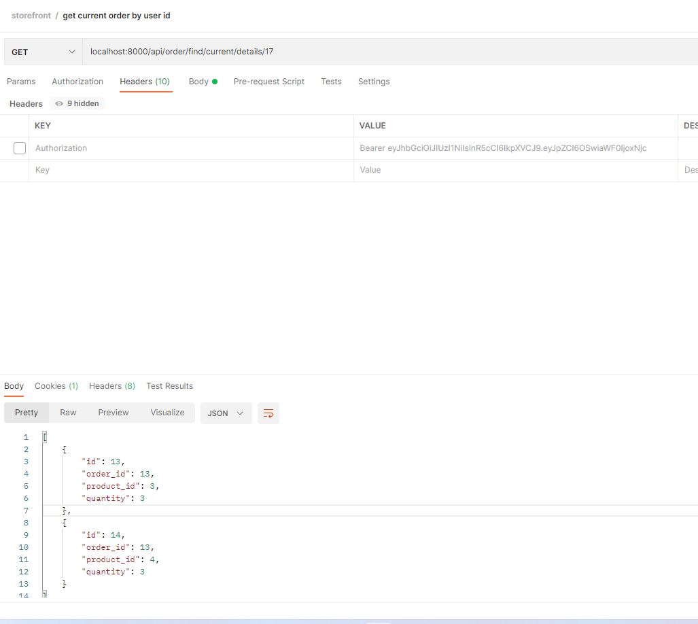

# Storefront-Backend
Udacity Web-Development ND aims to Build a JavaScript API based on a requirements given by the stakeholders.
## store idea
- this store has users and admins
- user can signup, signin, signout, show all products and prouct by id, show his/her own profile,
    create new order, check his/her current orders.
- admin can do the regular user functions, however, admin has extra access and authority as show all 
    users,create new product, show all orders, show order by id.
- please make sure to signin to have access to most of the features except sor navigating products.
- the authentication will check based on the request if it requires admin or not.
- create account as admin first so you can continue.
- create the database one for testing and one for development.
- you can find a  postman collection in the project folder.
### All scripts will be found in the package.json
## Run The project
- make sure to have .env file to set up all variablesyou will find an exammple for it under the name .envExamples
1. Go to API folder.
2. run npm install "to download all the node-modules in the package.json".
run db-migrate up to run migrate the database.
3. to run the API: npm run start.
4. Go to postman and you can follow the endpoints in the requirements.md or import the collection.
## Compile the project
1. Go to API folder open Bash or the terminal.
2. To compile run: npm run build.
3. the compiled files will exist in the build folder.
4. you can run the compiled code by: nodemon build/server.js.
## Run the unit tests
1. Go to API folder, Bash or the terminal.
2. To run the unit tests:
    - you can run npm run build then npm run jasmine.
    - or you can run npm test.

# Folders Structure
## samples folder
assets folder containes:
    - some examples screenshots.
## build folder
- contains the compiled code.
## spec folder
- contains jasmine configuration for unit test.
## src folder contains the TypeScript code
1. ### server.ts which starts the server.
2. ### routes folder
    - contains the user route and call the handers to handle the user requests.
    - contains the product route and call the handers to handle the product requests.
    - contains the order route and call the handers to handle the order requests.
3. ### handlers
- The logic function which starts processing based on the criteria
4. ###  services
- In order to write a clean code, there are two files:
    - auth file contains the middlwares for authentication
    - order_products to insert the products of the order.
    ##### Notes
    - note, in order to add anything that requires authentication and signin, you'll need
        to add authorization header "if it was a full stack the client should send it in the request header" with bearer and the token, but in order to facilitate
        this process I'm puttuing it as a middlware in the "putToken function" in auth services which will automatically generate it.
5. ### tests
- contains the unit tests for the API including:
    - Test the endpoint.
    - test the database.
## Samples
### Note, this process only the jpg format.
- successfully test:

- signup information:

- signin:

- allUsers and signedin as admin:

- get products:

- create product:

- create order:

- show current order:
