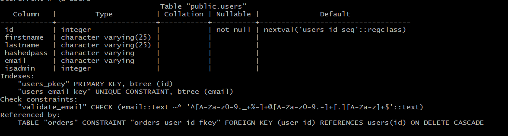
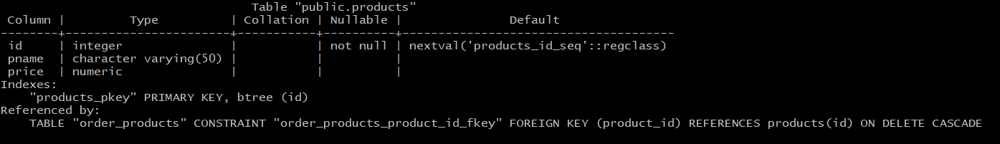
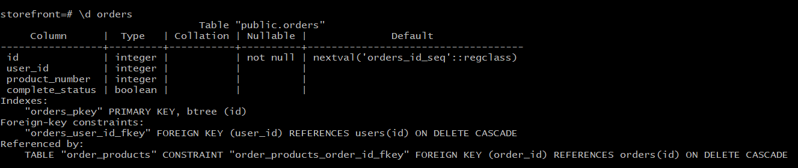
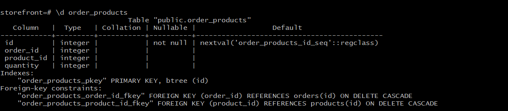

# API Requirements
The company stakeholders want to create an online storefront to showcase their great product ideas. Users need to be able to browse an index of all products, see the specifics of a single product, and add products to an order that they can view in a cart page. You have been tasked with building the API that will support this application, and your coworker is building the frontend.

These are the notes from a meeting with the frontend developer that describe what endpoints the API needs to supply, as well as data shapes the frontend and backend have agreed meet the requirements of the application. 

## API Endpoints
#### Products
- Index : get localhost:8000/api/product
- Show : get localhost:8000/api/product/find/:productId
- Create [require signin as admin]: post localhost:8000/api/product/create/:userId
- [OPTIONAL] Top 5 most popular products 
- [OPTIONAL] Products by category (args: product category)

#### Users
- Index [require signin as admin to show all users]: get localhost:8000/api/user/:userId 
- Show [require signin]: get localhost:8000/api/user/find/:userId
- Create : post localhost:8000/api/user/signup
##### extra
- signin : post localhost:8000/api/user/signin
- signou: post localhost:8000/api/user/signout

#### Orders
- Current Order by user [require signin]:"with details" get localhost:8000/api/order/find/current/details/:userId
##### extra
- get all orders [require signin as admin] : get'localhost:8000/api/order/:userId'
- get order by id [require signin ] : get 'localhost:8000/api/order/find/:orderId'
- get current order witout details[require signin] : get 'localhost:8000/api/order/find/current/:userId'
- post new order [require signin] : post 'localhost:8000/api/order/create/:userId'
- [OPTIONAL] Completed Orders by user (args: user id)[token required]

## Data Shapes
#### Product
-  id
- name
- price
- [OPTIONAL] category

#### User
- id
- firstName
- lastName
- password
##### extra 
- email uniuqe
- isadmin 
#### Orders
- id
- id of each product in the order
- quantity of each product in the order
- user_id
- status of order (active or complete)
#### order_products
- id
- order_id
-product_id
- quantity
##### Notes
    - note, in order to add anything that requires authentication and signin, you'll need
        to add authorization header "if it was a full stack the client should send it in the request header" with bearer and the token, but in order to facilitate
        this process I'm puttuing it as a middlware in the "putToken function" in auth services which will automatically generate it.
## database schema
- users shcema:

- products schema:

- orders schema:

- order_products schema:

